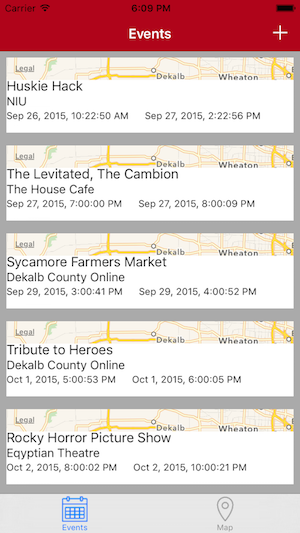

# Gathr
Find things to do, wherever you go!  

Gathr is an iOS app written in Swift which placed 3rd in the Civic category at NIU's Huskie Hack!    

## Screenshots   
   
   
  

## About Gathr   
Gathr uses your location to find events around you in an easy to display list, or view the map to see how close local events are to your location! Have an event that you would like to host? You can easily add it to the map! Simply click the "+" button on the EventListView to add your own event that will show up to all the users around your location.

##Team Members

[Kyle Haptonstall][kyle-github]

[Charlie Roth][charlie-github]   

[Pravin Kandala][pravin-github]   

[kyle-github]:  http://github.com/khaptonstall
[charlie-github]:  http://github.com/charlieroth
[pravin-github]: http://github.com/pravinkandala
